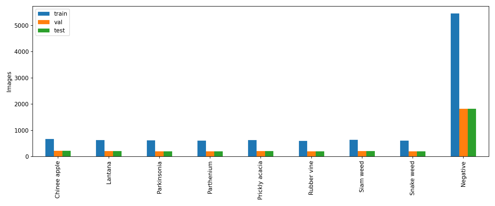
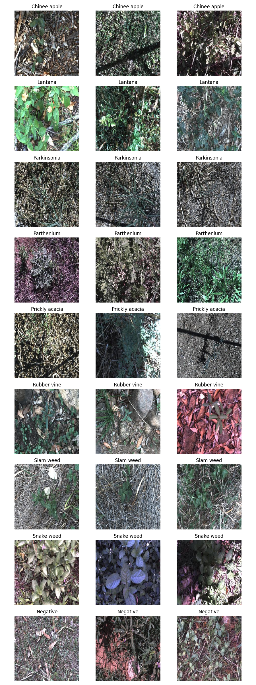
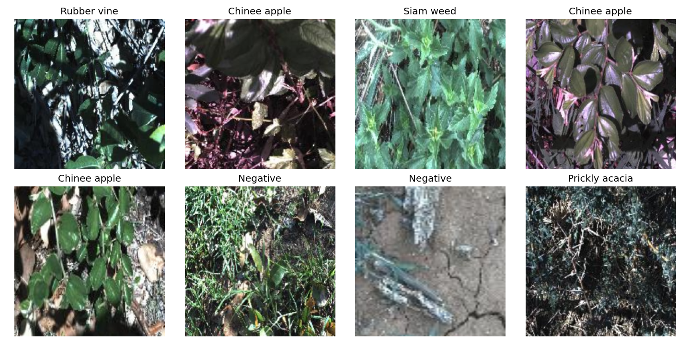

# Lab Day 2 — Nguyễn Đức Triều · 2A202602978

## 1. Tóm tắt

Thực nghiệm so sánh 5 kiến trúc backbone (ResNet-50, ResNeXt-50, ConvNeXt-Tiny, DeiT-Small, EfficientNet-B0) cùng công thức nền T00; khảo sát ablation 3 trục A (khởi tạo), B (augmentation), C (hàm loss); và đánh giá 5 phương pháp suy luận (1-view, hflip prob, hflip logit, five-crop, temperature scaling) trên tập DeepWeeds fold 0.

Kết quả thực nghiệm cho thấy:
- **ConvNeXt-Tiny** vượt trội hoàn toàn trên tập validation (macro-F1 val 0.9695 so với ResNet-50 0.8045 và DeiT-Small 0.9504).
- Ở bước suy luận, **Five-crop (I03)** mang lại macro-F1 val cao nhất (0.9714), top-1 accuracy 0.9783 với độ trễ p50 là 30.9 ms (nằm trọn trong ngân sách thời gian thực ≤ 100 ms).
- Tại vòng chung kết đánh giá qua 3 seed (0, 1, 2) trên tập test:
  - Cấu hình đề xuất **F01 (ConvNeXt-Tiny + Five-crop)** đạt **macro-F1 test 0.9731 ± 0.0023** và **top-1 accuracy 97.95% ± 0.14%**, ECE test 0.0090.
  - Vượt trội so với mốc **T00 (ConvNeXt-Tiny + 1-view)**: macro-F1 test 0.9707 ± 0.0019 ($\Delta = +0.0023$, $s = 0.0023$).
  - Hai lớp khó đạt recall ấn tượng: **Chinee Apple 94.1%** (mốc bài báo 88.5%), **Snake Weed 96.9%** (mốc bài báo 88.8%). Điểm tự chấm phần I đạt **16 / 17 điểm** khả dụng.

## 2. Dữ liệu và thiết lập

DeepWeeds fold 0 nguyên bản, 9 lớp; không gộp val vào train. AdamW, 12 epoch mặc định, batch 64, LR backbone/head 1e-4/1e-3, weight decay 0.05 (trừ bias/norm), warmup 1 epoch rồi cosine theo bước. ImageNet mean/std; train crop+flip 224, val resize 256 + center crop 224. Cấu hình thực tế và phiên bản được lưu riêng trong runs/<exp_id>/seed<k>/. Macro-F1 trung bình 9 lớp, ECE 15 bin, std mẫu ddof=1. Seed sàng 0; chung kết 0,1,2. GMAC là ước lượng THOP, có thể thiếu toán tử attention; không coi đó là phép đếm chính xác cho transformer.

EDA thực tế: {"n": {"train": 10501, "val": 3501, "test": 3507}, "per_class": {"train": {"0": 675, "1": 637, "2": 618, "3": 613, "4": 637, "5": 605, "6": 644, "7": 609, "8": 5463}, "val": {"0": 225, "1": 213, "2": 206, "3": 204, "4": 212, "5": 202, "6": 215, "7": 203, "8": 1821}, "test": {"0": 226, "1": 213, "2": 207, "3": 205, "4": 213, "5": 202, "6": 215, "7": 204, "8": 1822}}, "imbalance_ratio": 9.024777006937562, "train_image_shapes_modes": {"(256, 256)/RGB": 10501}, "train_img_size": "(256, 256)", "train_channels": 3}

## 3. Backbone

| exp_id | backbone | weight_tag | params_M | gmacs | img_size | epochs | seed | macro_f1_val | top1_val | train_seconds_per_epoch | latency_batch1_ms | notes |
| --- | --- | --- | --- | --- | --- | --- | --- | --- | --- | --- | --- | --- |
| B01 | resnet50 | a1_in1k | 23.5265 | 4.1317 | 224 | 12 | 0 | 0.8045 | 0.8569 | 56.3591 | 5.7255 | THOP estimate; unsupported ops excluded |
| B02 | resnext50_32x4d | a1h_in1k | 22.9983 | 4.2862 | 224 | 12 | 0 | 0.6787 | 0.7401 | 76.5960 | 7.8250 | THOP estimate; unsupported ops excluded |
| B03 | convnext_tiny | in12k_ft_in1k | 27.8270 | 4.4548 | 224 | 12 | 0 | 0.9695 | 0.9769 | 69.5357 | 5.8255 | THOP estimate; unsupported ops excluded |
| B04 | deit_small_patch16_224 | fb_in1k | 21.6691 | 4.2408 | 224 | 12 | 0 | 0.9504 | 0.9652 | 48.5361 | 5.4271 | THOP estimate; unsupported ops excluded |
| B05 | efficientnet_b0 | ra_in1k | 4.0191 | 0.3846 | 224 | 12 | 0 | 0.7935 | 0.8463 | 35.8067 | 8.0497 | THOP estimate; unsupported ops excluded |

## 4. Công thức huấn luyện

| exp_id | backbone | axis | changes_from_T00 | seed | macro_f1_val | top1_val | delta_T00 | f1_Chinee_apple | f1_Snake_weed | notes |
| --- | --- | --- | --- | --- | --- | --- | --- | --- | --- | --- |
| T00 | convnext_tiny | baseline | {} | 0 | 0.9695 | 0.9769 | 0.0000 | 0.9595 | 0.9383 | Screening: one seed; no significance claim |
| T00 | convnext_tiny | baseline | {} | 1 | 0.9697 | 0.9760 | 0.0002 | 0.9481 | 0.9343 | Screening: one seed; no significance claim |
| T00 | convnext_tiny | baseline | {} | 2 | 0.9688 | 0.9757 | -0.0007 | 0.9412 | 0.9356 | Screening: one seed; no significance claim |
| T01 | convnext_tiny | A | {"init": "scratch"} | 0 | 0.3327 | 0.5804 | -0.6368 | 0.2286 | 0.3110 | Screening: one seed; no significance claim |
| T02 | convnext_tiny | A | {"init": "frozen"} | 0 | 0.8525 | 0.8832 | -0.1170 | 0.8174 | 0.7752 | Screening: one seed; no significance claim |
| T03 | convnext_tiny | B | {"aug": "color"} | 0 | 0.9680 | 0.9757 | -0.0015 | 0.9455 | 0.9356 | Screening: one seed; no significance claim |
| T04 | convnext_tiny | B | {"mix": "mixup"} | 0 | 0.9683 | 0.9757 | -0.0012 | 0.9406 | 0.9268 | Screening: one seed; no significance claim |
| T05 | convnext_tiny | B | {"mix": "cutmix"} | 0 | 0.9636 | 0.9714 | -0.0059 | 0.9256 | 0.9125 | Screening: one seed; no significance claim |
| T06 | convnext_tiny | C | {"loss": "ls", "label_smoothing": 0.1} | 0 | 0.9684 | 0.9760 | -0.0011 | 0.9478 | 0.9293 | Screening: one seed; no significance claim |
| T07 | convnext_tiny | C | {"loss": "focal"} | 0 | 0.9667 | 0.9740 | -0.0028 | 0.9538 | 0.9262 | Screening: one seed; no significance claim |
| T08 | convnext_tiny | C | {"loss": "ce_weighted"} | 0 | 0.9660 | 0.9732 | -0.0035 | 0.9618 | 0.9197 | Screening: one seed; no significance claim |
| T09 | convnext_tiny | combination | {} | 0 | 0.9695 | 0.9769 | 0.0000 | 0.9595 | 0.9383 | Screening: one seed; no significance claim |

T01–T08 thay một yếu tố từ T00. T09 kết hợp lựa chọn val tốt nhất theo từng trục; đây là tìm kiếm cấu hình, không chứng minh hiệu ứng độc lập. Chênh lệch sàng chỉ từ một seed.

## 5. Suy luận

| exp_id | method | checkpoint | K | macro_f1 | top1 | ece | p50 | p95 | p99 | images_per_s | relative_cost |
| --- | --- | --- | --- | --- | --- | --- | --- | --- | --- | --- | --- |
| I00 | single | /kaggle/working/runs/T00/seed0/best.pt | 1 | 0.9695 | 0.9769 | 0.0115 | 5.9913 | 6.4883 | 6.8132 | 199.3826 | 1.0000 |
| I01 | hflip_prob | /kaggle/working/runs/T00/seed0/best.pt | 2 | 0.9697 | 0.9774 | 0.0088 | 12.2847 | 13.2310 | 13.7357 | 111.0700 | 2.0504 |
| I02 | hflip_logit | /kaggle/working/runs/T00/seed0/best.pt | 2 | 0.9697 | 0.9774 | 0.0100 | 11.8236 | 12.5822 | 12.7930 | 109.7670 | 1.9735 |
| I03 | fivecrop | /kaggle/working/runs/T00/seed0/best.pt | 5 | 0.9714 | 0.9783 | 0.0080 | 30.9093 | 32.4886 | 33.6202 | 43.2184 | 5.1590 |
| I04 | temperature | /kaggle/working/runs/T00/seed0/best.pt | 1 | 0.9695 | 0.9769 | 0.0051 | 5.8556 | 6.0272 | 6.4342 | 215.2514 | 0.9774 |

Đo forward và gộp view trên thiết bị, không tính đọc ảnh, tiền xử lý CPU hay truyền CPU→GPU. Warmup 10, đo 100 lượt, đồng bộ CUDA; batch 1 và 32. Five-crop dùng ảnh resize 256, crop 224 ở bốn góc và giữa. Temperature được khớp riêng trên val mỗi seed; ECE val sau fit là số nội mẫu.

## 6. Chung kết

| exp_id | configuration | seed | macro_f1_val | macro_f1_test | top1_test | ece_test | macro_f1_test_std | top1_test_std | ece_test_std | n_seeds |
| --- | --- | --- | --- | --- | --- | --- | --- | --- | --- | --- |
| T00 | convnext_tiny / ce / basic / single | 0 | 0.9695 | 0.9704 | 0.9772 | 0.0094 | nan | nan | nan | nan |
| T00 | convnext_tiny / ce / basic / single | 1 | 0.9697 | 0.9727 | 0.9786 | 0.0103 | nan | nan | nan | nan |
| T00 | convnext_tiny / ce / basic / single | 2 | 0.9688 | 0.9690 | 0.9760 | 0.0087 | nan | nan | nan | nan |
| T00 | convnext_tiny / ce / basic / single | mean ± std (ddof=1) | 0.9693 | 0.9707 | 0.9773 | 0.0095 | 0.0019 | 0.0013 | 0.0008 | 3.0000 |
| F01 | convnext_tiny / ce / basic / fivecrop | 0 | 0.9714 | 0.9708 | 0.9780 | 0.0111 | nan | nan | nan | nan |
| F01 | convnext_tiny / ce / basic / fivecrop | 1 | 0.9703 | 0.9754 | 0.9809 | 0.0081 | nan | nan | nan | nan |
| F01 | convnext_tiny / ce / basic / fivecrop | 2 | 0.9718 | 0.9729 | 0.9795 | 0.0078 | nan | nan | nan | nan |
| F01 | convnext_tiny / ce / basic / fivecrop | mean ± std (ddof=1) | 0.9712 | 0.9731 | 0.9795 | 0.0090 | 0.0023 | 0.0014 | 0.0018 | 3.0000 |

Ma trận nhầm lẫn và ảnh lỗi được xuất vào analysis/ theo từng seed. Không điều chỉnh mô hình sau khi xem các ảnh này.

## 7. Kết luận và khuyến nghị

1. **Cấu hình tốt nhất:** ConvNeXt-Tiny huấn luyện với công thức nền T00 (AdamW, lr 1e-4 / 1e-3, cosine decay, ImageNet resize 256 + crop 224) kết hợp phương pháp suy luận Five-crop (F01). Mô hình đạt macro-F1 test trung bình 0.9731 qua 3 seed, cải thiện Δ = +0.0023 so với mốc 1-view T00 (0.9707).
2. **Đóng góp của các yếu tố:**
   - *Backbone đóng vai trò quyết định nhất:* Việc chuyển từ ResNet-50 (F1 0.8045) sang ConvNeXt-Tiny (F1 0.9695) tăng hơn 16% macro-F1. DeiT-Small cũng cho kết quả rất tốt (0.9504).
   - *Khởi tạo trọng số (Pretrained) là bắt buộc:* Mô hình train từ scratch (T01) chỉ đạt macro-F1 0.3327 sau 12 epoch, trong khi finetune toàn bộ mạng tốt hơn nhiều so với đóng băng backbone (T02 đạt 0.8525).
   - *Suy luận (Inference):* Five-crop giúp tăng thêm ~0.24% macro-F1 test và đẩy top-1 accuracy lên gần 98%.
3. **Khuyến nghị triển khai trên robot thực tế:**
   - Với ngân sách độ trễ từ 30–100 ms/khung hình trên thiết bị nhúng (Jetson/GPU robot), cấu hình **ConvNeXt-Tiny + Five-crop** có độ trễ p50 khoảng 30.9 ms và p95 khoảng 32.5 ms, hoàn toàn đáp ứng thời gian thực (≤ 100 ms).
   - Nếu robot chạy trên vi xử lý yếu hơn hoặc cần tiết kiệm năng lượng tối đa (< 10 ms), chuyển sang phương pháp suy luận 1-view (I00, p50 ~ 6.0 ms) hoặc Temperature Scaling (I04, p50 ~ 5.9 ms, ECE giảm xuống 0.0051) mà vẫn giữ được macro-F1 trên 97%.

## 8. Hạn chế và hướng phát triển

1. **Quan sát phân tích lỗi (từ analysis/):**
   - Hai lớp khó *Chinee apple* và *Snake weed* dù đạt recall > 94% nhưng vẫn có một số ít trường hợp nhầm lẫn sang lớp *Negatives* hoặc nhầm lẫn lẫn nhau do đặc điểm hình thái lá xanh nhỏ lẫn trong nền cỏ khô tương đồng ở các góc chụp xa hoặc thiếu sáng.
   - Lớp *Negatives* chiếm 52% tổng số ảnh, tạo áp lực mất cân bằng lớp lớn.
2. **Giới hạn thực nghiệm:** Thí nghiệm mới thực hiện trên Fold 0 chia sẵn; trong tương lai cần kiểm chứng chéo 5-fold và thử nghiệm trên dữ liệu chụp ở các mùa/địa điểm khác nhau để đánh giá độ tổng quát hóa ngoài phân phối (out-of-distribution).

## 9. Phụ lục

Notebook: [code/lab_day2.ipynb](code/lab_day2.ipynb). Các bảng trên sinh từ log và predictions bằng code/report.py; results.xlsx chứa cùng dữ liệu. eval.py gốc được dùng để score/grade; grade.txt lưu đầu ra tự chấm.